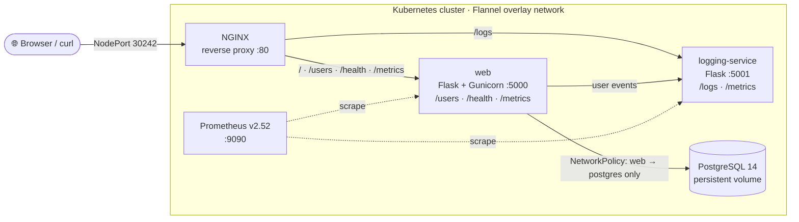

<div align="center">


# Flask Microservices on Kubernetes & Docker Swarm — NGINX, PostgreSQL, Logging Service & Prometheus Monitoring

**A hands-on DevOps reference project: one CRUD app split into containerized services, deployable on Minikube with Flannel networking or on Docker Swarm, with network policies and Prometheus metrics.**

<p>
  
  
  
  
  
  
  
</p>

[Architecture](#-architecture) · [Kubernetes](#-option-1--kubernetes-minikube--flannel) · [Docker Swarm](#-option-2--docker-swarm) · [Monitoring](#-monitoring-with-prometheus) · [API](#-rest-api)

</div>

---

A **microservices-based CRUD application** for managing users through a web UI and REST API. It's built to practise the things that matter in production container platforms: **reverse proxying, service discovery, persistent volumes, network policies, a dedicated logging service and metrics scraping** — on two orchestrators.

## 🏗️ Architecture



| Service | Role | Image |
|---|---|---|
| **nginx** | Reverse proxy routing `/`, `/users`, `/health`, `/metrics` to web and `/logs` to the logging service | `intikhab49/new-nginx-name:v1.1` |
| **web** | Flask CRUD app + Bootstrap UI served by Gunicorn; forwards user events to the logger and exposes `requests_total` metrics | `intikhab49/myapp-web:v3.2` |
| **logging-service** | Receives events over HTTP and writes them to `crud-logs.log`; instrumented with `prometheus_flask_exporter` | `intikhab49/logging-service:v3.1` |
| **postgres** | User data on a persistent volume | `postgres:14-alpine` |
| **prometheus** | Scrapes `web:5000` and `logging-service:5001` | `prom/prometheus:v2.52.0` |

**Security:** `web-to-postgres-policy.yaml` only lets `web` pods reach Postgres on 5432, and `network-policy.yaml` only lets `nginx` pods reach `web`.

## ✅ Prerequisites

Docker · Minikube · kubectl (for Kubernetes) · Docker Engine in Swarm mode (for Swarm) · Git

```bash
git clone https://github.com/intikhab49/kubernetes-flask-microservices.git
cd kubernetes-flask-microservices
```

## ☸️ Option 1 — Kubernetes (Minikube + Flannel)

**1. Start Minikube with the Flannel CNI**

```bash
minikube start --network-plugin=cni --cni=flannel --memory=4096
```

**2. Build and load the images**

```bash
docker build -t intikhab49/myapp-web:v3.2 .
minikube image load intikhab49/myapp-web:v3.2

docker build -t intikhab49/new-nginx-name:v1.1 ./nginx
minikube image load intikhab49/new-nginx-name:v1.1

docker build -t intikhab49/logging-service:v3.1 ./logging-service
minikube image load intikhab49/logging-service:v3.1
```

**3. Deploy**

```bash
kubectl apply -f postgres-deployment.yaml
kubectl apply -f web-deployment.yaml
kubectl apply -f nginx-deployment.yaml
kubectl apply -f logging-deployment.yaml
kubectl apply -f web-to-postgres-policy.yaml   # optional network policy
kubectl apply -f prometheus/prometheus-config.yaml
kubectl apply -f prometheus/prometheus-deployment.yaml
```

**4. Open it**

```bash
minikube service nginx --url      # e.g. http://192.168.49.2:30242
```

## 🐳 Option 2 — Docker Swarm

```bash
docker swarm init
./deploy.sh
```

`deploy.sh` removes any previous stack, cleans up the overlay network, deploys `docker-compose.yml` as the `my-app` stack (Postgres, web, NGINX published on port **9000**) and shows a live view of services and container IPs. The compose file expects the web and NGINX images in a local registry at `localhost:5000`.

```bash
curl http://<swarm-node-ip>:9000/users
docker service logs my-app_web
```

## 📡 REST API

| Method | Endpoint | Description |
|---|---|---|
| GET | `/` | Web UI |
| GET | `/users` | List users |
| POST | `/users` | Create a user `{"name", "email"}` |
| PUT | `/users/{id}` | Update a user |
| DELETE | `/users/{id}` | Delete a user |
| POST | `/logs` | Send an event to the logging service |
| GET | `/health` · `/metrics` | Health check · Prometheus metrics |

```bash
URL=$(minikube service nginx --url)
curl -X POST $URL/users -H "Content-Type: application/json" -d '{"name": "Intikhab", "email": "intikhab@example.com"}'
curl $URL/users
curl -X POST $URL/logs -H "Content-Type: application/json" -d '{"event": "test"}'
```

## 📈 Monitoring with Prometheus

```bash
kubectl port-forward svc/prometheus 9090:9090
```

Open **http://localhost:9090** → *Status → Targets* and confirm `web:5000` and `logging-service:5001` are **UP**. Useful queries:

```promql
requests_total{job="web"}                          # requests by method + endpoint
rate(requests_total{job="web"}[5m])                # requests per second
flask_http_request_total{job="logging-service"}    # events received by the logger
```

Read the event log from the logging pod:

```bash
kubectl exec -it <logging-pod-name> -- cat /app/crud-logs.log
```

## 🗂️ Project structure

```
app.py · models.py · templates/ · static/     # Flask CRUD web service + UI
Dockerfile · start.sh                          # web image (Gunicorn) + Postgres-wait startup script
nginx/                                         # NGINX image, config and entrypoint
logging-service/                               # logging microservice
prometheus/                                    # Prometheus ConfigMap + Deployment
*-deployment.yaml                              # Kubernetes Deployments + Services
web-to-postgres-policy.yaml · network-policy.yaml   # Kubernetes NetworkPolicies
docker-compose.yml · deploy.sh                 # Docker Swarm stack
```

## 🧬 Project lineage

This is the most complete version of a three-step learning path:
[flask-postgres-crud-dashboard](https://github.com/intikhab49/flask-postgres-crud-dashboard) (Docker Compose) → [kubernetes-flask-crud](https://github.com/intikhab49/kubernetes-flask-crud) (Kubernetes + NGINX) → **kubernetes-flask-microservices** (+ logging service + Prometheus).

---

<div align="center">

**Built by [Intikhab Azam](https://github.com/intikhab49)** — AI & automation engineer · backend · DevOps

<sub>Keywords: Kubernetes microservices example · Docker Swarm · Minikube Flannel · NGINX reverse proxy · Flask REST API · PostgreSQL · Prometheus monitoring · Kubernetes NetworkPolicy · DevOps project · Python</sub>

</div>
